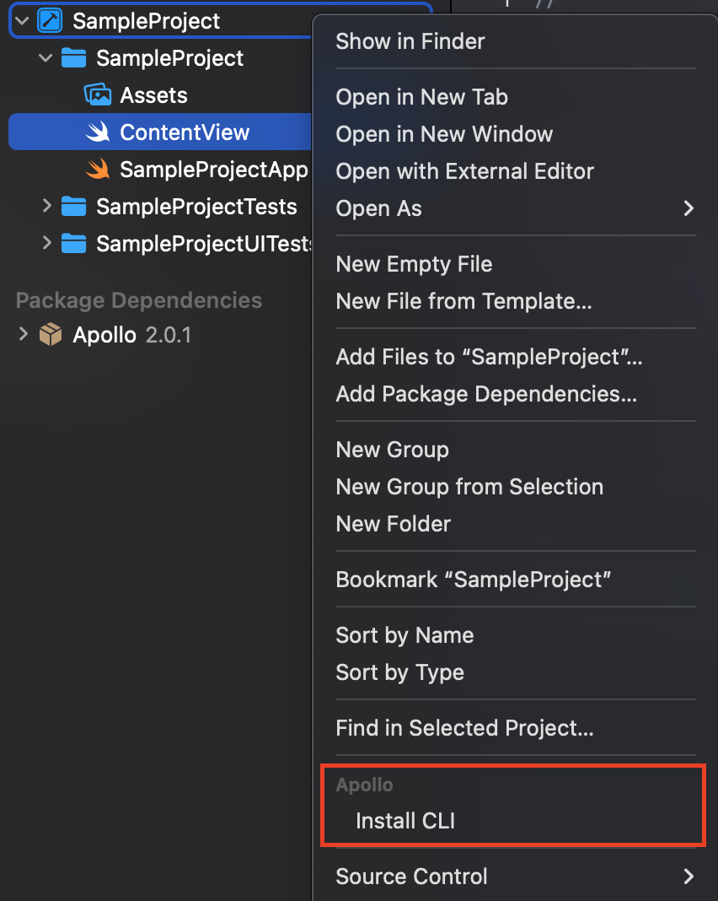

import SPMInstallCLI from "../cli-install/spm.mdx"
import SPMXcodeInstallCLI from "../cli-install/spm-xcode.mdx"
import PodsInstallCLI from "../cli-install/pods.mdx"
import SetupCodegenPanel from "./single-panel.mdx"

<a name="spm-setup-codegen" />
<For of={[{
  title: "SPM with Package.swift",
  cliPath: "./apollo-ios-cli",
  moduleTypeOption: "`.swiftPackageManager`",
}, {
  title: "SPM with Xcode Project",
  cliPath: "./apollo-ios-cli",
  moduleTypeOption: "`.swiftPackageManager`",
}, {
  title: "Cocoapods",
  cliPath: "./Pods/Apollo/apollo-ios-cli",
  moduleTypeOption: "`.other`",
}]} as="installType">
  <a name={`spm-${installType.title.toLowerCase().replace(/ /g, "-")}`} />

  <ExpansionPanel title={installType.title}>
    <ExpansionPanelList>
      <ExpansionPanelListItem>

      #### Install the Codegen CLI

      <If condition={installType.title === "SPM with Package.swift"}>
        The Apollo iOS SPM package includes the Codegen CLI as an executable target. This ensures you always have a valid CLI version for your Apollo iOS version.

        To simplify accessing the Codegen CLI, you can run the included `apollo-cli-install` SPM plugin. This plugin builds the CLI and creates a symbolic link to the executable in your project root.

        If using a `Package.swift` file, you can install the CLI by running:

        ```bash
        swift package --allow-writing-to-package-directory apollo-cli-install
        ```

        After the plugin installs, it creates a symbolic link to the Codegen CLI (named `apollo-ios-cli`) in your project root folder. You can now run the CLI from the command line using `./apollo-ios-cli`.

        > **Note:** Because the `apollo-ios-cli` in your project root is only a symbolic link, it only works if the compiled CLI executable exists. This is generally located in your Xcode Derived Data or the `.build` folder. If these are cleared, you can rerun the Install CLI plugin to rebuild the CLI executable.
      </If>

      <If condition={installType.title === "SPM with Xcode Project"}>
        The Apollo iOS SPM package includes the Codegen CLI as an executable target. This ensures you always have a valid CLI version for your Apollo iOS version.

        To simplify accessing the Codegen CLI, you can run the included `InstallCLI` SPM plugin.

        This plugin builds the CLI and creates a symbolic link to the executable in your project root.

        If you use Swift packages through Xcode, you can right-click on your project in the Xcode file explorer, revealing an **Install CLI** plugin command. Selecting this command presents a dialog allowing you to grant the plugin "write" access to your project directory.

        

        After the plugin installs, it creates a symbolic link to the Codegen CLI (named `apollo-ios-cli`) in your project root folder. You can now run the CLI from the command line with `./apollo-ios-cli`.

        > **Note:** Because the `apollo-ios-cli` in your project root is only a symbolic link, it only works if the compiled CLI executable exists. This is generally located in your Xcode Derived Data or the `.build` folder. If these are cleared, you can rerun the Install CLI plugin to rebuild the CLI executable.
      </If>

      <If condition={installType.title === "Cocoapods"}>
        If you use Cocoapods, Apollo iOS compiles the Codegen CLI into an executable shell application during `pod install` (located in `Pods/Apollo/apollo-ios-cli`).

        After installing the Apollo iOS pod, you can run the Codegen CLI from the directory of your `Podfile`:

        ```bash
        ./Pods/Apollo/apollo-ios-cli ${Command Name} -${Command Arguments}
        ```

        > **Note:** If you are using `:path` in your Podfile to link to a local copy of Apollo iOS, the CLI will not be automatically available. You will need to manually build the Codegen CLI. See the [CLI installation guide](/ios/code-generation/codegen-cli#installation) for directions on how to do that.
      </If>

      </ExpansionPanelListItem>

      <ExpansionPanelListItem>

      #### Initialize the code generation configuration

      The Codegen CLI uses a JSON file to configure the code generation engine. You can use the Codegen CLI's `init` command to create this file with default values.

      From your project's root directory, run the following command with your customized values:

      <CodeBlock
        code={installType.cliPath + " init --schema-namespace ${MySchemaName} --module-type ${ModuleType}"}
        language="bash"
      />

      - `${MySchemaName}` provides a name for the namespace of your generated schema files.
      - `${ModuleType}` configures how your generated schema types are included in your project.
        > This is a crucial decision to make **before configuring code generation**. To determine the right option for your project, see [Project Configuration](/ios/project-configuration/intro).
        >
        > To get started quickly, you can use the `embeddedInTarget` option.
        > Using `embeddedInTarget`, you must supply a target name using the `--target-name` command line option.

      Running this command creates an `apollo-codegen-config.json` file.

      </ExpansionPanelListItem>
      <ExpansionPanelListItem>

      #### Configure code generation options

      Open your `apollo-codegen-config.json` file to start configuring code generation for your project.

      The default configuration will:

      - Find all GraphQL schema files ending with the file extension `.graphqls` within your project directory.
      - Find all GraphQL operation and fragment definition files ending with the file extension `.graphql` within your project directory.
      - Generate Swift code for the schema types in a directory with the `schema-name` provided.
      - Generate Swift code for the operation and fragment models in a subfolder within the schema types output location.

      </ExpansionPanelListItem>
      <ExpansionPanelListItem>

      #### Run code generation

      From your project's root directory, run:

      <CodeBlock
        code={installType.cliPath + " generate"}
        language="bash"
      />

      The code generation engine creates your files with the extension `.graphql.swift`.

      </ExpansionPanelListItem>
      <ExpansionPanelListItem>

      #### Add the generated schema and operation files to your target

      By default, a directory containing your generated schema files is within a directory with the schema name you provided (i.e., `MySchemaName`). Your generated operation and fragment files are in a subfolder within the same directory.

      If you created your target in an Xcode project or workspace, you'll need to manually add the generated files to your target.

      > **Note:** Because adding generated files to your Xcode targets must be done manually each time you generate new files, we highly recommend defining your project targets with SPM. Alternatively, you can generate your operations into the package that includes your schema files. For more information see the documentation for [Code Generation Configuration](/ios/code-generation/codegen-configuration).

      </ExpansionPanelListItem>
    </ExpansionPanelList>
  </ExpansionPanel>
</For>