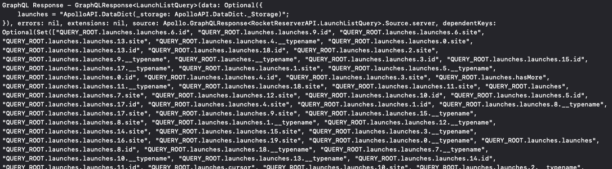

To use the generated operations in `RocketReserverAPI`, you first create an instance of `ApolloClient`. This instance takes your generated code and uses it to make network calls to your server. It's recommended that you have a single instance of this object that you use throughout your codebase.

## Create an ApolloClient

1. First let's create a new Swift file called `ApolloClient+Setup.swift`.

2. Now add the following code into the file:

```swift title="ApolloClient+Setup.swift"
import Apollo
import Foundation

extension ApolloClient {
    static let shared: ApolloClient = {
        return ApolloClient(url: URL(string: "https://apollo-fullstack-tutorial.herokuapp.com/graphql")!)
    }()
}
```

## Implement the query

To make sure your `ApolloClient` instance is communicating correctly with the server, go to `LaunchListViewModel`, add these imports, and add an `init()` with the following code:

```swift title="LaunchListViewModel.swift"
import Apollo
import RocketReserverAPI

...

init() {
    Task {
        do {
            let response = try await ApolloClient.shared.fetch(query: LaunchListQuery())
            if let errors = response.errors {
                print("Error fetching launches: \(errors)")
            }
            
            print("GraphQL Response - \(response)")
        } catch {
            print("Failure! Error - \(error)")
        }
    }
}
```

## Test your query

Build and run your application. The web host might take a few seconds to spin up your GraphQL server if nobody's been using it recently, but once it's up, you should see a response that resembles the following:



This means the request was correctly executed and you now have a list of launch sites 🚀🚀🚀.

Go ahead and remove the `init()`, we will fully use the `ApolloClient` in the next section.

Next, let's [connect this data to your UI](tutorial-connect-queries-to-ui)
